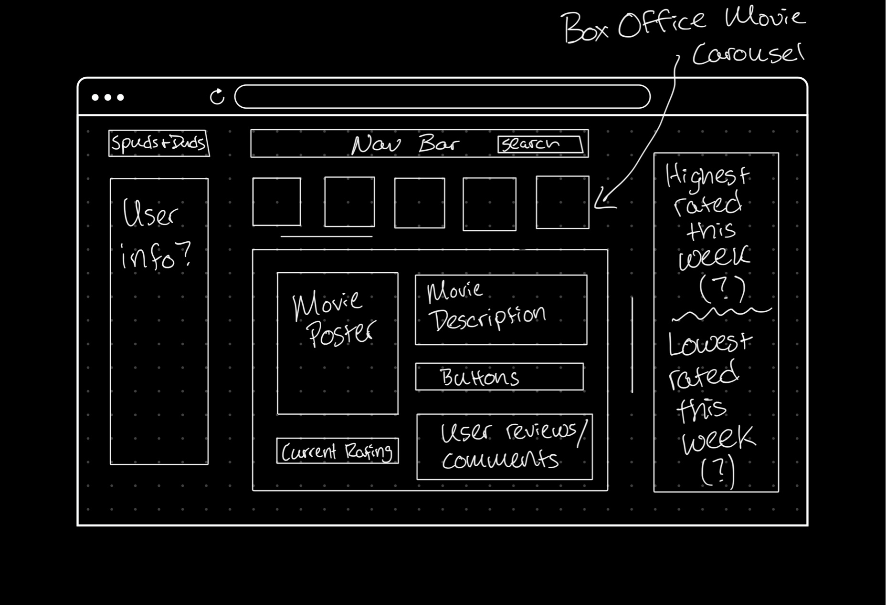
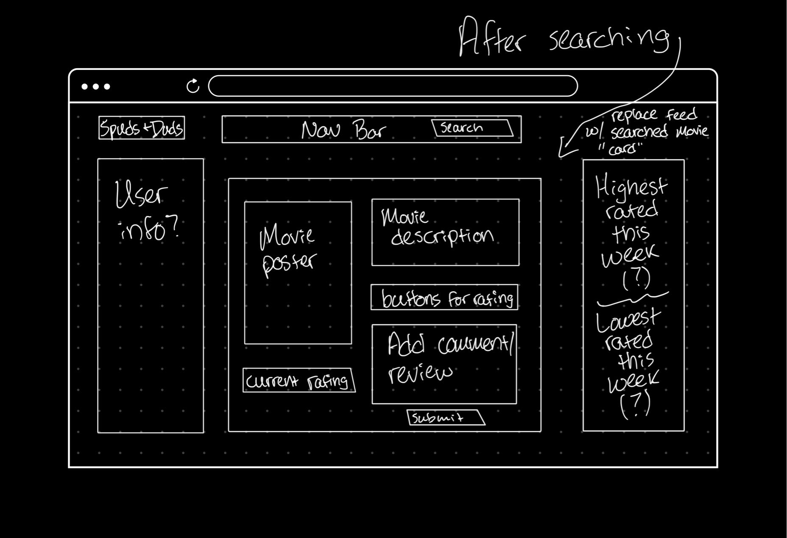
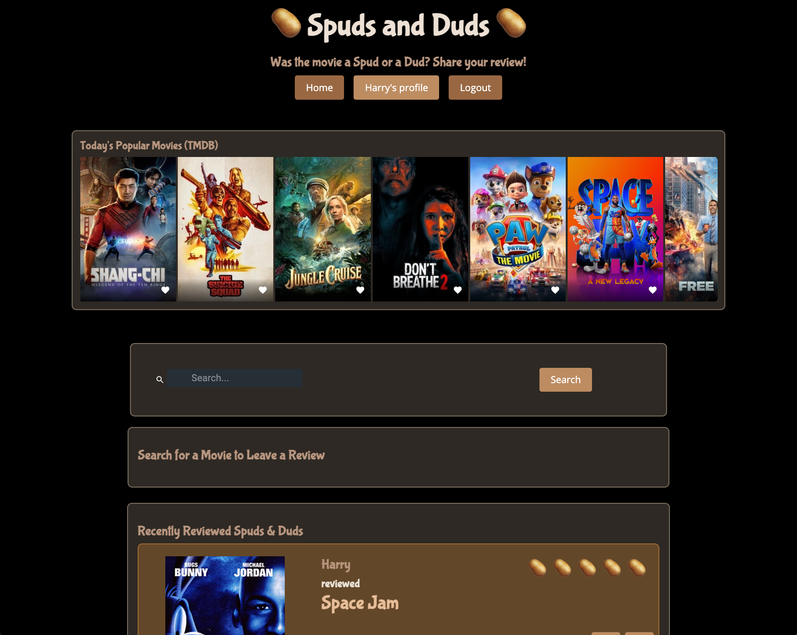

# SpudsandDuds-FullStackMERNApp
Spuds and Duds: a Social Movie Review Application  
Link to live deployed app: https://spudsandduds.herokuapp.com/

# Concept
Having a place where you can share your thoughts on a movie is every movie buffs passion. With Spuds and Duds we wanted to create a community that does just that.

# Purpose
Spuds and Duds gives you the chance to select from a database of movies to review and post for other to see.
  
Our motivation for developing this app is to give a cinephile a community to share their opinions on movies and interact with others with the same passion. 
  
As a user, you will be able to search a movie that gives a small description and then be able to post, edit, or delete a review. you can also comment on other reviews that are posted on the feed. 

# Wireframe development

# Images of Deployed Application

## Technologies Used
This project was created and deployed using React, MaterialUI, GraphQL, JWT, JavaScript, node.js (and associated packages), express.js, MongoDB, Axios, TMDB API, OMDB API, Bootstrp, HTML, CSS, and Heroku. 

## Future Development Plans
Averaging out all user reviews into one score.
  
Editing and deleting comments.
  
Dynamic functionality for like and dislike buttons.
  
Top Spud and Duds of the week.
  
Giving more user functionality to profile (friends list, watch list, upload profile images, etc). 
  
Ability to watch movie trailers. 
  
Ability to share to other social media platforms.

## License
[MIT](https://choosealicense.com/licenses/mit/)
 

This project was bootstrapped with [Create React App](https://github.com/facebook/create-react-app).

## Contact the contributors
Christyn Garcia  
https://github.com/christyns92
  
Harrison Kidd  
https://github.com/hkidd
  
Jessamyn McTwigan  
https://github.com/jessamyn27
  
Rico Perez  
https://github.com/ricoperez1
  
Thomas Limmer  
https://github.com/TLimmer19